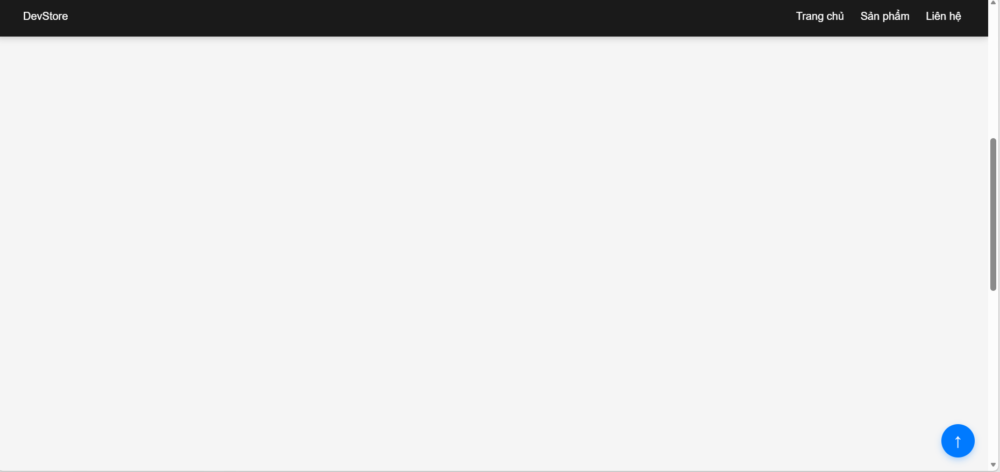
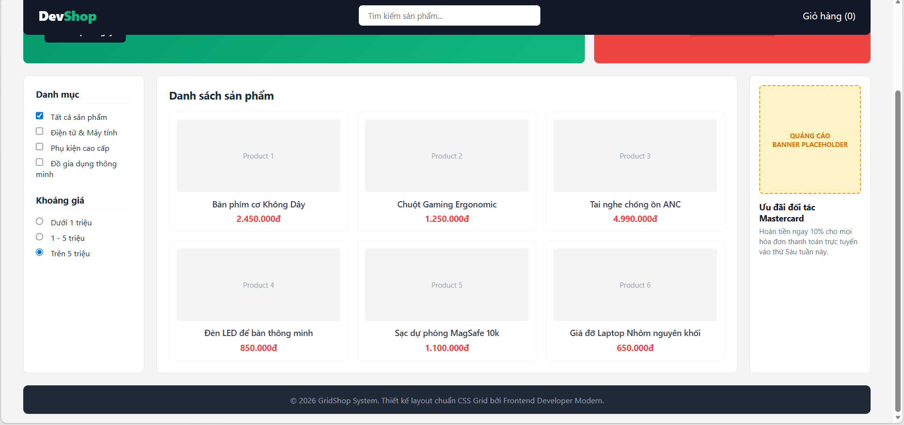
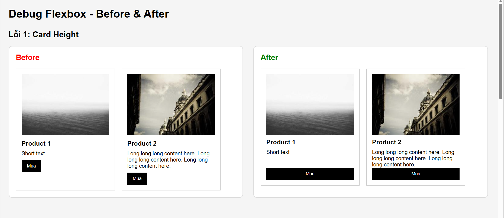

# PHIẾU BÀI TẬP 04
# **CSS LAYOUT — Positioning, Flexbox & Grid**

> **Tài liệu tham chiếu:** `12_css_positioning.md` + `13_creating_responsive_layouts.md`
>
---

## PHẦN A — KIỂM TRA ĐỨC HIỂU (20 điểm)

### Câu A1 (10đ) — 5 Loại Positioning

| Position | Vận chuyển chỗ trong flow? | Tham chiếu vị trí | Cuộn theo trang? | Use case |
|---|---|---|---|---|
| `static` | Có (default) | Không dùng `top/left/...` | Có | Mặc định cho phần lớn phần tử |
| `relative` | Vẫn trong flow | Dựa theo vị trí gốc của chính nó (vẫn chiếm chỗ cũ) | Có | Dùng làm “mốc” cho `absolute` con hoặc dịch nhẹ |
| `absolute` | Ra khỏi flow | Theo **nearest positioned ancestor** (cha gần nhất có `position` khác `static`); nếu không có thì theo `body`/viewport | Không cuộn theo phần tử cha (bám mốc tham chiếu) | Badge, dropdown, tooltip cần bám góc |
| `fixed` | Ra khỏi flow | Theo viewport (màn hình) | Không cuộn theo trang | Chat button, modal overlay |
| `sticky` | Vẫn trong flow nhưng “dính” khi đạt ngưỡng | Theo ngưỡng `top/right/bottom/left` | Có (cho tới khi dính rồi giữ cố định tương đối) | Sticky header, sidebar |

**Câu hỏi thêm:**
- `absolute` tham chiếu **body** khi: **không có** tổ tiên nào (cha/ancestor) có `position` khác `static`.
- `absolute` tham chiếu **parent** khi: trong cây DOM, tồn tại **cha gần nhất** có `position` khác `static`.
- “nearest positioned ancestor” = phần tử **ancestor gần nhất** (tính từ phần tử con đi ngược lên DOM) mà có `position` là `relative/absolute/fixed/sticky` (khác `static`).

### Câu A2 (10đ) — Flexbox vs Grid

```css
/* Trường hợp 1 */
.container { display: flex; }
.item { flex: 1; }
/* 4 items => 1 hàng (1 row), vì flex mặc định flex-wrap: nowrap */
```
```text
┌─────────────────────────────────────────────────────────┐
│ [ Item 1 ] [ Item 2 ] [ Item 3 ]  [ Item 4 ]            |
└─────────────────────────────────────────────────────────┘
```

```css
/* Trường hợp 2 */
.container { display: flex; flex-wrap: wrap; }
.item { width: 45%; margin: 2.5%; }
/* 6 items => mỗi hàng chứa 2 items (vì 45% + 2.5% + 45% + 2.5% = 95%);
   => 3 hàng, 2 cột */

```
```text
┌─────────────────────────────────────────────────────────┐
│  [  Item 1 (45%)  ]             [  Item 2 (45%)  ]      │
│  [  Item 3 (45%)  ]             [  Item 4 (45%)  ]      │
│  [  Item 5 (45%)  ]             [  Item 6 (45%)  ]      │
└─────────────────────────────────────────────────────────┘
```
```css
/* Trường hợp 3 */
.container { display: flex; justify-content: space-between; align-items: center; }
/* 3 items => 1 hàng */
```
```text
┌─────────────────────────────────────────────────────────┐
│ [Item 1]                [Item 2]                [Item 3]│
└─────────────────────────────────────────────────────────┘
```
```css
/* Trường hợp 4 */
.container { display: grid; grid-template-columns: 200px 1fr 200px; gap: 20px; }
/* 3 items => 1 hàng, 3 cột (mỗi item vào 1 column) */
```
```text
┌─────────────────────────────────────────────────────────┐
│ [Item 1: 200px]   [Item 2: 200px]   [ Item 3: 200px]    │
└─────────────────────────────────────────────────────────┘
```
```css
/* Trường hợp 5 */
.container { display: grid; grid-template-columns: repeat(3, 1fr); gap: 10px; }
/* 7 items => 3 cột mỗi hàng => 3 hàng (2+2+3 hoặc 3+2+2 tuỳ thứ tự dòng);
   item cuối sẽ nằm ở hàng 3, cột 1 (tính theo thứ tự DOM) */
```

```text
┌─────────────────────────────────────────────────────────┐
│ [ Item 1 (1/3) ]    [ Item 2 (1/3) ]    [ Item 3 (1/3) ]│
│ [ Item 4 (1/3) ]    [ Item 5 (1/3) ]    [ Item 6 (1/3) ]│
│ [ Item 7 (1/3) ]                                        │
└─────────────────────────────────────────────────────────┘
```
---

## PHẦN B — THỰC HÀNH CODE (60 điểm)

### Bài B1 (15đ) — Positioning Playground:

1. Trạng thái header khi scroll (chứng minh header fixed)

;

2. Trạng thái sidebar khi scroll (chứng minh sticky)

;


3. Badge trên card

;

### Bài B2 (20đ) — Flexbox Navigation & Cards

;

### Bài B3 (25đ) — Grid Layout — Trang E-Commerce

;

## PHẦN C — SUY LUẬN (20 điểm)

### Câu C1 (10đ) — Flexbox vs Grid: Khi nào dùng gì?
### 1. Navigation bar ngang (logo + menu + buttons)
* **Lựa chọn:** Dùng **Flexbox**.
* **Giải thích:** Thanh điều hướng (Navbar) là một layout theo trục ngang. Flexbox cực kỳ mạnh mẽ trong việc căn chỉnh và phân phối các khối dọc theo một trục đơn, giúp dễ dàng đẩy logo sang trái, nút bấm sang phải và căn giữa các phần tử theo chiều dọc một cách hoàn hảo thông qua `align-items: center`.

### 2. Lưới ảnh Instagram (3 cột đều nhau, số ảnh không biết trước)
* **Lựa chọn:** Dùng **Grid**.
* **Giải thích:** Đây là bố cục dạng lưới có cấu trúc số cột cố định (3 cột). Với CSS Grid, ta chỉ cần khai báo `grid-template-columns: repeat(3, 1fr)` cho container. Dù số lượng ảnh đổ về nhiều hay ít, trình duyệt sẽ tự động tính toán và xếp chúng thẳng hàng tăm tắp theo cả hàng dọc lẫn hàng ngang mà không lo bị lệch dòng.

### 3. Layout blog: main content + sidebar
* **Lựa chọn:** Dùng **Grid** (Hoặc dùng **Flexbox** đều được, nhưng Grid tối ưu hơn).
* **Giải thích:** Phân chia các khu vực lớn của một trang web (Page Layout) như vùng Nội dung chính (Main Content) và Thanh bên (Sidebar) nên được quản lý bằng CSS Grid (`grid-template-columns: 1fr 300px`). Grid giúp định hình khung tổng thể một cách cố định, rõ ràng và cực kỳ thuận tiện khi cần Responsive để dồn hàng khi chuyển sang màn hình di động.

### 4. Footer với 4 cột thông tin (Về chúng tôi, Liên kết, Hỗ trợ, Liên hệ)
* **Lựa chọn:** **Kết hợp cả hai**.
* **Giải thích:** * Sử dụng **Grid** cho khung lớn ngoài cùng của Footer để chia cấu trúc thành 4 cột bằng nhau (`grid-template-columns: repeat(4, 1fr)`), đảm bảo các khối thông tin luôn đồng bộ về độ rộng và khoảng cách `gap`.
  * Sử dụng **Flexbox** (`flex-direction: column`) bên trong từng cột nhỏ để xếp các đường link danh sách (dạng text) theo hàng dọc từ trên xuống dưới một cách linh hoạt.

### 5. Card sản phẩm (ảnh trên, text giữa, nút dưới — nút luôn dính đáy)
* **Lựa chọn:** Dùng **Flexbox**.
* **Giải thích:** Bản thân một Card sản phẩm là một luồng bố cục một chiều theo trục dọc (`flex-direction: column`). Khi kích hoạt Flexbox cho Card, ta có thể áp dụng thuộc tính `margin-top: auto` cho nút bấm nằm dưới cùng.

---

### Câu C2 (10đ) — Debug Flexbox

**Lỗi 1:** Cards không đều chiều cao — nút "Mua" bị nhảy lên/xuống

* **Nguyên nhân:** Các card có lượng nội dung khác nhau nên chiều cao mỗi card khác nhau. Do đó nút "Mua" không nằm cùng vị trí giữa các card. Ngoài ra `.card` chưa dùng Flexbox theo chiều dọc nên không thể đẩy nút xuống cuối card. 
* **Code sửa:**
```css
.card-container {
    display: flex;
    flex-wrap: wrap;
}
.card {
    width: 30%;
    margin: 1.5%;
    display: flex;
    flex-direction: column;
}
.card img {
    width: 100%;
}
.card h3 {
    font-size: 18px;
}
.card .btn {
    padding: 10px;
    margin-top: auto;
}
```

* **Kết quả sau khi sửa:**
;

**Lỗi 2**: Muốn items nằm giữa cả ngang lẫn dọc nhưng vẫn dính góc trái trên
* **Nguyên nhân:** `display: flex` chỉ kích hoạt Flexbox nhưng chưa canh giữa nên item vẫn nằm góc trên bên trái.

* **Code sửa:**
```css
.hero {
    height: 100vh;
    display: flex;
    justify-content: center;
    align-items: center;
}
.hero-content {
    text-align: center;
}
```
* **Kết quả sau khi sửa:**
;

**Lỗi 3:** Sidebar bị co lại khi content quá dài
* **Nguyên nhân:** Flexbox sẽ co các phần tử lại để đủ không gian khi content quá dài
* **Code sửa:**
```css
.layout {
    display: flex;
}
.sidebar {
    width: 250px;
    flex-shrink: 0;
}
.content {
    flex: 1;
}
```
* **Kết quả sau khi sửa:**
;